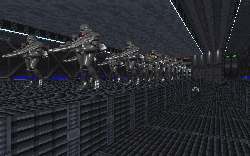

I really enjoy it when an author decides to make a level because they have an interesting story to tell(at least when they do a good job with it). Anyone who has read any of my reviews knows how much stock I put in the story beind a level. Here is some of the proof. The author has started out with a continuation of the Dark Forces story, using the various aspects LucasArts provided for us and taking them to new and exciting levels.

In here you'll get the chance to revisit the wreckage of the Arc Hammer, and the author has done a fantastic job of setting up the mood for you. Darkened rooms abound in here, with collapsed stairways, fallen doors, and depressurized areas. The corpses littering the halls and the dim flickering of the lights are the only remaining testimonials of what once was a powerful ship. You get to search through all types of areas to complete your goals, with the perfect mix of new and familiar to keep you interested for the duration of the level. Another great thing is that the level is very interactive, allowing you to choose your adversaries in sections, and how much of the storyline you uncover depends upon your actions during the mission. A variety of new sounds and ideas makes this a really enjoyable level.

But this level, like every other one, has drawbacks. Here there is a lack of attention to textures in some places. In elevators the textures don't always match correctly, and in one part of the Arc Hammer you only get a monotone white for the walls, and grey for the floor. I would expect some interruption of this at some point in a hallway, other than a door. A window to the out side, or a control panel. Something other than just the same texture running up and down the lengthy corridors. It's too bad, because each of these problems could have been fixed with just a little manipulation.

## Overall

I'm very sure you'll enjoy this level a lot. There are many surprises, puzzles to challenge, and a story that really should be told. It will require all of your skills to uncover the secrets behind the Arc Hammer, so gear up, and download this right away.