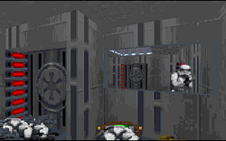

The story that sets the base for this level has some flaws, and the level doesn't do much to grow beyond it. It starts out great, with some edited cutscenes from TIE Fighter, and some altered sections from Dark Forces. It sets the beginning of a mood that really fails to continue.

The level is based mostly on the Detention Center level in Dark Forces, with many of the same features that were used in the game. But where this level differs from the Dark Forces version is in it's failure to incorporate certain features of a detention center with areas from the Star Wars movies, and to create a realistic environment. The level feels slapped together, almost as if the author had a good idea, but failed to see it through. The player is forced to follow a direct route between areas. It seems like the author tried to make it interesting; there's a sewer system, and an area that looks like a control center that could lead to prison cells. But you never get the feeling like you're in a building that could exist. When you reach the sewer, you jump in and follow the stream for a bit, but then immediately it ends in a platform, with an armed guard standing near it. There's no where for the sludge to go. And even though this is supposed to be a prison planet, there's nowhere to keep the prisoners. You never see a corridor that could lead to prison cells. Little things like this slowly begin to tear apart the illusion of reality.

There are several things that the author did do well. The atmosphere in some places is excellent. My favorite effect is the thunderstorm that settles in while the player is inside the base. Complete with lightning and thunder, it's a really fine accomplishment that displays what the author is capable of. Unfortunately, there isn't much else to see. You travel via elevator for half the time, and just shoot up stormtroopers the other half. There are no puzzles worth solving, and there's no real difficulty in taking out the guards. Saving grace: the author had the good sense not to throw in a few Dark Troopers just to up the difficulty level.

The player feels a little empty by the time he/she reaches the landing platform again. You've recovered the navigation data, but there's no sense of accomplishment. That's due in part to the fact that the level isn't diffcult, but also to the story. Now that you've retrieved the NavaCard the Rebels can plan a rescue, but I left feeling like I'd abandoned the prisoners to their fate. I was all geared up to go after the shuttle and wreak havoc on the Imps, but there was nothing left to do.

## Overall

In short, the level has been done before, and it's been done better, not only by LucasArts, but by other independent level designers. Perhaps with another level or two to advance the story and bring it to a real conclusion this level could really be great. But for now, if you want to infiltrate a prison, find a different way or play level 6 over again.