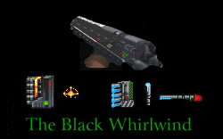

This has been, for me, one of the most anticipated levels for a long time. I loved the first and was anxious to devour the next offering. And this level doesn't disappoint.

Without the security of having a Star Wars setting to use as a basis for the level architecture I was curious as to how the author would do this time out. But I shouldn't have been worried; the castle is a great blend of ancient masonry and flickering torches combined with the familiar sterile settings of the Empire. This castle avoids the pitfall of monotony similar levels didn't by alternating the two styles and using different textures for the castle aside from the regular stone blocks. There are also lots of new items that keep the area alive and vibrant and set the mood for an ancient dungeon.

You'll find to accompany the nice texture choices the textures are also placed with extreme care. BMs on the walls aren't just slapped around, and stairs are made to exacting standards where every stone tile fits precisely.

New puzzles and ideas pop up all over the castle as well. The most obvious is a new underwater section, but a stepping stone area straight from Indiana Jones is a cool new touch. You'll need to think to make your way through the level rather than just use your blaster.

And speaking of weapons, there is no debating that it's the new rifle that steals the show. The creator has obviously put a lot of thought into what works and what doesn't, and the outcome is remarkable. I've already used the patch to modify my own Dark Forces playing. The Black Whirlwind is something you just have to try.

One thing that most people will probably overlook is the great use of sounds in this level. From the new ones for the Black Whirlwind to the thunder, the creaking doors and the new dialogue, it's something that adds new dimension to the mission. Would it be quite the same if Riia Goltend were to have her lines displayed at the top of the screen rather than speak them? Of course not. The new sounds are great, but like I said you probably won't notice unless you specifically look for them, which makes them even better; well done and useful, but not overpowering.

Some things bug me though. The story isn't very clear: why is Trem Goltend suddenly allied with the Rebels after having tried so hard to escape them in the last level? It gives me the feeling that this genius is also a bit mentally unstable; which might not be a bad idea at that. I also would have liked to find a bit more to shoot at here. The Phase I DTs aren't tough anymore and once you've gotten the Black Whirlwind the level is a piece of cake. Normally I hate it when people emphasize mayhem over puzzles, but I have to admit the level felt a little vacant.

##Overall

There's something here for everybody to take a look at. Level designers can admire the architecture and texturing along with the ideas, weapons enthusiasts can drool over the Black Whirlwind and those into more subtle aspects can enjoy the other items around. Any way you put it, this is a level you have to play.

You can also read the review of [Operation Archangel Episode I - Mos Eisley: The Maze](/missions/archangel/).
