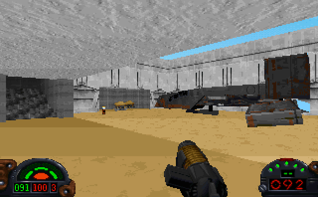

From the beginning of the level, you know it's going to be good. It has its own text crawl (always a good sign), and the level begins with you standing next to the Crow in a landing area just like the one the Millenium Falcon was in at the beginning of "Star Wars." There are some new fuel canister-type FMEs lying around, plus doors that lead to a small bathroom and storage room. Then, you climb a set of stairs, walk through a room of crates, and the excitement begins. This level lives up to its name of "The Maze", as you wander through the archways and streets of Mos Eisley, the way George Lucas would have made it look in the movies, if he had had the money and resources. There are nice looking new arches and stone textures, and many small domed houses you can walk into. It's easy to get lost sometimes, but you probably won't mind as you take in the sights and sounds of this level. The opposition consists entirely of smugglers and the like (Trandoshans, Grans, and a lot of Jawas with VOCs from the movies), and it's really fun to stealthily walk through the alleys, where danger lurks around every corner (how poetic!).

You also get to jump across the rooftops, and see a pretty good facsimile of the type of house Luke lives in at the beginning of Star Wars (of course, that was in the middle of the desert, but then, this could be anybody's house.) From there, be prepared for some surprises about Jawas (you'll see!), the notorious Cantina, and a visit from an old enemy.

## Overall

All in all, this is a really fun, exciting level. It's definitely one of the best to represent a place from the movies, and maybe the best Tatooine level (Although level four of DF96 and "The Great Tatooine Water Hunt" are also excellent ones). You'll really have fun completing this mission.