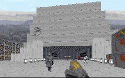

I love it when level authors manage to use locations from the movies and wrap a story around them. It allows us to walk through the areas we saw on the big screen or TV, and experience them again in a new way. Return to Bespin was the first to do this, and now Back to Yavin has succeeded brilliantly with the same notion.

Taking his cues directly from *A New Hope*, the author has done a great job of creating a wonderful Yavin environment. He's done a good job of replicating the pyramids we all know and love, and the approach to the planet in the opening cutscene in reminiscient of the Falcon's flight. The cutscenes are another bonus that really adds to the level. They're pieced together from parts of X-Wing, Dark Forces, and Rebel Assualt, and they're not overbearing, but just add a little extra to the mixture. The really nice part was to be able to look up and see Yavin over the mountains on the horizon. Lots of little things other people might miss have been used to make you feel like you're on Yavin 4, not just another Imperial base.

But really, all of this won't work without a story, and there's a great one to accompany this. Building off existing plot lines, and using characters we're already familiar with, but not sick of yet, the author sets you up for a treat. You know that Yavin will be enjoyable. You know there are puzzles to work out, nice architecture to look at, original textures, FMEs and 3DOs to marvel at. But he's taken his story and developed it with all these things. For instance, he's made mention that the base is undergoing renovation by the Imperials. So there are construciton people working on the base. Some things are broken, lights flicker, like you might expect at a construction site. Another cool idea is to have the characters you meet further the story as you progress. Some familiar droids offer some information, and you need to talk to Gardine to know where he's hidden the tape.

One thing that did bug me were some flaws in the order in which things were accomplished. I infiltrated the base and expected to find Gardine next. But instead I ran into the coupling for the sequencer charge first. This suggests I should set the charge without having found Gardine or the tapes. This makes no sense; I would first want to ensure the safety of the prisoner, then blow the base to bits. But I planted the charge anyway, and was then forced to listen to the alarm sirens blaring through the rest of the level. It's not a big problem, but it sure does get on your nerves.

## Overall

I loved this level. There are lots of hidden surprises, chracters to meet, things to see, and fresh ideas to keep you interested. My favorite thing about this level was walking down the aisle of the throne room. I had to pull out my Star Wars soundtrack and do that a few times. There are lots more things to find here as well, so download this one at your convenience.
