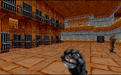
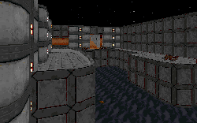

I have often thought that the DF engine would allow for all kinds of cool things to be done with lighting, and lots of other interesting architecture bits. I've also noticed that lots of people don't spend the time to take full advantage of these properties. At last, here is a level whose author made the time, and it shows.

While deep underneath this level is just a variant of the "escape from detention center" bit, the author had the good sense to modify the story and have Boba Fett steer away from the Imperials. Setting the level in a Hutt's palace gives the level the ability to run in new directions, with new designs in architecture and puzzles.

I also applaud the authors use of the story to build the level. I don't enjoy seeing Boba Fett pop up in every level because there's no basis for it, but here we get a new idea that picks up off the original DF plot line. Boba Fett diehards might be a little disturbed that the legendary bounty hunter gets his reputation damaged further, but I think the author did a great job of presenting Boba Fett in a realistic and positive light. The final confrontation at the end of the level feels really good, and puts a great cap to the experience.

The best thing about this level is the way it looks. Textures all line up, and are set to make the buildings look constructed, not created. And there is a difference. And the architecture throughout the palace is wonderful. Lots of new ideas you'll want to stop and look at. Shading has also been put to excellent use all over, and combined with the various lighting effects the author uses, it takes the palace lightyears beyond most other levels.

You'll also notice that the level is difficult, without being impossible. The puzzles aren't too tough, but provide enough challenge to keep you interested. You'll have lots to shoot at too, including some new characters using new WAXes and VOCs that look and sound really good.

## Overall

I have yet to find the perfect DF level, where a great story, good architecture, reasonable difficulty and new ideas and objects just pull you in and when you get done you want to reload and do it all over. This level comes the closest I've seen for a single level, and while it isn't perfect, you'll definitely want to add it to your collection.