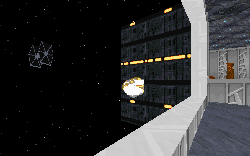

**Leia:** "I though you had decided to stay..."
**Han:** "Yeah, well that bounty hunter we ran into on Ord Mantell changed my mind."

Not many people notice this short exchange between Han and Leia in ESB, and even less understand what it means. Somewhere along the way to Hoth Solo ran into a bounty hunter from Jabba the Hutt, who convinced him he needed to pay up soon. Now we finally get to hear(and interact with) the story of that incident.

Without giving too much away, I can safely say that you get to go up against just about every bounty hunter in the book in this level, each one of them competing for the same prize. Not only does the story the author has crafted fit well with what we know from Star Wars, it also gives us a nice idea of what happened to Kyle later on. And the story gets deeper and more complex (read: interesting) as you progress through the level.

But enough of that. This level has a lot of stuff you'll want to check out. Lots of really nice architecture is employed around the station. The whole level is constructed to fit the design of the station, which keeps the level from feeling random. And contrary to lots of other levels where the design is fixed, you can see different parts from windows, look back to where you've been, and it all continues without giving you a sense of monotony. That's a flaw most levels can't seem to overcome, but the author here does a good job.

There are lots of other nice touches that keep you from getting bored. My personal favorite is an elevator stretching from the main section to a tower. One side is open to the outside and you can watch the lower half of the station fall away as you rise. It's rather reminiscient of the Space Needle here in Seattle, or other towers where you reach the top via elevator. It's a pretty impressive piece of work that looks great in motion, not to mention the Imperial Star Destroyer hovering just outside.

 pay off big in this level.")

Another nice bit is a grate that you can walk across over some sewage. Other authors might have been content to make it a platform, but here you can look down and see the sludge below. It's a small touch that pays off big.

And you needn't worry about not having enough to shoot at. As I mentioned earlier, all the bounty hunters you can think of are here, and you face off with them all. All of the WAXes are nicely done, especially the Boba Fett WAX. It's the first time I've seen the walking Fett in action, and it really looks great. Of course I can't forget to include the station personnel out to stop the hunt, or the Imperials in pursuit of the Rebel fleet; you need to get by them as well. There're also a lot of civilians to populate the station to make it feel full. This was something I thought was missing in LucasArts rendition of a space station, and I'm glad the author corrected it.

The puzzles aren't terribly complex, but the author more than made up for it with a challenging force thrown against you. And with everything that's going on around the station, I didn't really have time to notice when I was playing.

This level does have a couple problems. The VUEs are pretty jerky sometimes, something that could be fixed pretty easily. It isn't quite the same when the ship comes to a sudden halt or changes course rapidly while in flight. It breaks the spell the level has put over you. And the biggest problem is that the level will only run on Easy right now. Something seems to be missing in one of the more difficult levels, and of course that makes the thing crash. If the author would kindly remedy this, I would be hard pressed to find anything else wrong.

## Overall

This is a great level, with some really nice architecture, cool effects throughout the station, and a great story to tell. Top that off with the professional looking cutscenes he's pieced together and you've got a real winner.