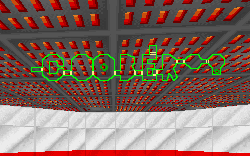

It's been a long time since I've seen crap like this. I may get fussy about little things like texture placement and alignment, lighting, story, geometry, etc, but I don't think I've ever found a level as pointless as this one.

I was warned, but failed to heed the advice. I told myself that I needed to try the level in order to review it. I was foolish. You can look at the image, and that's all you'll need to see. There is no plot, the only goal is to find Jan(why, I don't know), and most of the textures haven't even been changed from the default. Are we supposed to take this level seriously?

I really hope not. Boba Fett, Darth Vader, enough stormtroopers to make you sick, misaligned textures... this level is just a slapstick job. The secrets aren't even worth it, since the "hidden" doors show up on the map.

## Overall

I never thought that I could sink this low in rating a level, but then I guess I'd never played something like Coober before. By policy I have to add a link to the level so you can try it for yourself, but I would really suggest keeping the mouse away from it.