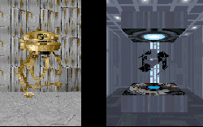
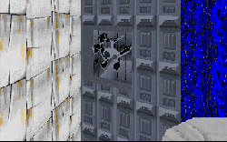

This is one of the largest and most detailed levels ever created for Dark Forces. It was also one of the first ones, and I first tried it about a year ago. I was enthralled by all the new things packed into this level. I never got a chance to play the first version, but the Collector's Edition has so many creative ideas and settings to enhance gameplay that I will never tire of playing this level.

The story itself offers up so many oppoortunities for the author to add little details to the level, and he takes full advantage of them. He also puts in several areas which can help you along the way, but are in no way necessary to completing the level. There's at least one building that the first time I skipped right by, but when coming back to play again, I noticed several additional things to explore. I don't doubt that I'll find something new every time I play this level, because not everything is obvious at first. There are lots of new WAXs and 3DOs that you can find, but you might miss some of the more subtle things; I'll let you play the level rather than cover them all here.

The design of this level is one of the best things about it. You get to see waterfalls, cliffs and you need to work your way into the base rather than get plopped right into it at the begining. It takes you back to level four of Dark Forces, and I think this author has improved substantially on the original in ways.

In his text file the author also warns that the level is hard, and he isn't kidding. The base is guarded heavily, and I found myself running out of ammo in key situations. I think that's more due to my trigger-happy nature than to any fault on the part of the author. But the puzzles are what make this level even more interesting. Even what may on the surface seem like a relatively simple concept can be twisted to provide a real challenge. I spent many a frustrating time going back and forth trying new things to work my way past a particular problem. And even if you can figure everything out, there are Dark Troopers galore to battle against. You're going to need every bit or skill and cunning you can muster to make it by this level on the Hard setting. It took me several tries to make it myself, and then only by memorizing the sequence of events, and learning to conserve ammo and shields. This is one level that will make you work for whatever you get.

## Overall

This level is one of the classics, and one no Dark Forces fan should be without. If you can, grab the custom-made cutscene by Carl Kenner; the experience is definitely worth the hard drive space and download time. But even without, there is enough here to keep you challenged and interested for a long time.