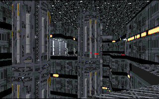

This is a very large level, and as I made my way through it, I was constantly amazed at the ability of the author to create so many different environments in one area, and yet manage to tie them all together. You need to find different keys to make your way through, but I found myself so entranced by the scope of the level and the detail involved that finding the keys became a secondary goal. My first was to explore the entire place and discover everything there was about it.

This level is so incredible that if I didn't know better I would assume it was an original from Dark Forces. The size is amazing, and it is absolutely bug free. There are no loose ends lying around and I found myself challenged while playing. There are numerous puzzles to solve, and I had to play it twice before I managed to complete it. The puzzles aren't the only thing the author throws at you; there are plenty of enemies, and he doesn't dump all of the weapons on you to combat them. One of my favorite things was how he set up the confrontations, either ducking and firing between the cargo boxes of the depot, or playing hide and seek in a dimly lit room. It was fun and difficult at the same time.

I was rather amazed to discover the lack of a story behind this level; usually Star Wars and Dark Forces fans love to take the opportunity to carve out their own niche in the Star Wars Universe. But while playing the level, it occured to me that the abscence of the story seemed to work for it. Without it, the depot is just another Imperial facility scheduled for demolition by Katarn, and the anonimity of it creates a bit of mystery around the place.

## Overall

I still can't really get over the lack of a story. It would have made the level so much more fun, and without it, the level does have a bit of a bland feel. On the plus side, even without a plot the author does a great job with this level, and it is worth playing.