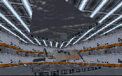
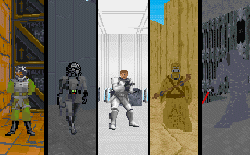
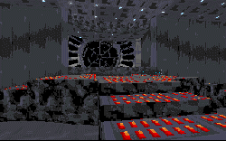

I'm not going to try to put a thoughtful introduction into this review. I just can't figure out what I want to write. So I'll just give you my initial reaction to playing Dark Forces 96.

Wow.

In case you didn't get that, I'll repeat it.

Wow.

If I had to accurately describe this set of levels, I'd refer to it as an expansion disk for Dark Forces. The authors have gotten together to create a fabulous story, and constructed levels that bring it to life.

If I was to really do it justice, I'd need to expound on all the different settings and new ideas the authors have brought into each of the levels. But to do that I'd spoil everything for all of you when you try it. So I'll attempt to give you an overview of what you can expect, without ruining it.

You can expect new settings, settings you recognize, and adapted settings from the movies that have been enhanced with creative ideas. You will find new characters, old characters, and each of them will be vivid and have a personality. You will travel to many different places, all flung across the galaxy, and everywhere you go the atmosphere will reflect the area around it, and it will feel natural, not contrived. There will be times when you are nervous, apprehensive, happy, fulfilled, disapointed, and frustrated. But most of all, you will probably have the best time you can find in an add-on to Dark Forces.

In order to set their level apart from being just another set of levels in Dark Forces, the authors have come up with some new surprises, not the least of which is the extensive amount of artwork that has been done. New textures cover the walls, and new 3DOs are evident in many of the levels. And new sounds also help to enhance the experience, from new dialogue to music. There are lots of new and edited things in this set a Dark Forces player will appreciate.

But rather than settle for throwing a lot of flashy new graphics at you, these levels will also challenge your playing ability. The puzzles are some of the more complex I've found, and many times you might find yourself traveling down one avenue, then discover you need to backtrack and fix something before you can continue. There are also numerous secrets to be found, often with some humorous results.

To sum it all up, the authors have created a new chapter in the history of Dark Forces, and I have no doubt the players who use the levels will enjoy it. The best thing about these levels is that they each take on their own distinct feel, but they do it without seperating themselves from the other five. DF96 does not feel like six levels put together to form a unit, but six levels that are each a part of a greater whole. I have always thought that a story is the best way to begin a level. If you start with a story you want to tell, it helps bring ideas to the level, and also helps you to flesh it out and give it some depth. The authors here have achieved something you won't find in every level you download; they tell you a story. This story wraps you up and will not let you go until you've done everything the authors have set out for you to accomplish, and overcome every obstacle they've set in your path.

## Overall

Are you still reading this? If so, stop and download this new set of levels right now. There's no excuse for not at least trying it, and I'm sure many players will zip it up for use and enjoyment in the years to come.