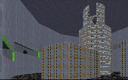

This is one tough level to get through. Not only are there more enemies and death traps than you'd find in several other levels combined, but the author has put in several puzzles for you to figure out. This level will tax your skills as a Dark Forces player, and I doubt anyone will complete it on the first try. As the author says, this level will require you to play it several times before you finally master it. But after running through it, I can't help but wonder why anyone would really want to.

The author loves to make you jump. The hardest jumping combinations I've found in a level to date are in here. But after the first couple, you begin to want something different. The exterior jumping sequences have a point. But later it starts to feel like the author can't come up with anything different. Some of the sequences are pointless: why would you need to jump from conveyor belt section to section? Aren't the belts supposed to carry cargo? This kind of design might work great for Super Mario Brothers, but in Dark Forces, it's just plain annoying.

I also want to know where the author got some of his other ideas for construction. The center is set up like an obstacle course. For some levels that's great, since that's the point. But here the area is supposed to serve a purpose, to transport and distribute Imperial cargo. Half the belts lead to nowhere, and often there are alcoves with troops in them, but no way for the troops to have gotten there, and no purpose for the alcoves other than to serve as smiper points. There's no thought to the construction of this level's surroundings.

There's also no real point to the plot. Jan has the plans and is trapped, right? But when you get to the end, it becomes very obvious she could have made it out herself. And why does Kyle start out with no wepaons? Why would he purposefully walk into an Imperial depot completely unarmed? And why are there Dark Troopers of all phases in the base, when the DT project hasn't even been approved by Darth Vader yet? And what is Boba Fett doing here? Fairly rapidly the level takes on the feel of a rough draft, much like a paper a student hurridly scribbles out during lunch before his next class.

## Overall

Any player who makes it through this level should be commended on his skills. The level is tough, and confusing. It also doesn't have a point, and failed to keep me interested. If you want to see if you can make it through, try the level out. But otherwise leave it alone.
