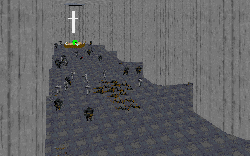

The best part about this level is probably the design of the monastary. It's not huge, or overly complex, but it does have some secret rooms, passageways, and a large center chamber reminiscient of the massive cathedrals in Europe. One could argue that the author should have added a great deal more detail in order to enhance the experience, but I would say that the simplicity of the design works well when considering the lifestyle the monks would lead.

The story is also an interesting mixture of Christian beliefs with the Star Wars Universe. It gives a good description of how the Revives and Extra Lives work, and the process of their construction. But I would like to know how the Empire has managed to cross such vast distances of Time and Space to reach Earth, when all the events we are familiar with occured "a long time ago, in a galaxy far, far away..."

I also wish that the author had put a little more into the level. The monastary is nice to look at and walk through, but that's really all the level consists of. The goals are pretty simple to complete, and the level doesn't offer anything else. It's not difficut due to the nature of the story, and the puzzles are pretty much nonexistant.

## Overall

I enjoyed the architecture of the monastary; ducking from pillar to pillar, trading shots with the troopers down below was lots of fun. But the level was too short for me to really enjoy, and too easy to offer any real fun or frustration. It might be one to download on Easter, just for fun.