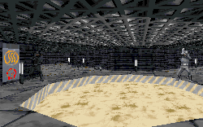

I usually don't like levels where the author takes one of the originals and modifies it. Even if extensive work has been done, I find myself looking at it and thinking to myself, "Here's where this used to be, this is where this happened," etc. It spoils the fun to not be treated to a new idea. So you can imagine my initial reaction upon looking at the title.

Hopefully you can also imagine my delight as I worked my way deeper and deeper into this level. The author has left the original base, for the most part, just the way it was before. What he has done with it is exactly what was described in the text file. The entire base is empty, abandoned, and you get the feeling the whole place has been closed down for a number of years. About the only thing that could have made it better would be to add a layer of dust over the floor, and have it kick up as you walked.

The second part of the level is not quite as fun, since it doesn't really do anything new. The author has taken a lot of old ideas, mixed them up, thrown them around, and has succeeded in making a fairly decent environment. There are several nice things; for instance I enjoyed the lighting that turned on as you entered the room. I got the feeling that the Imperials had been lying low with power down to avoid detection, which might very well be the case if you read the story the author has included.

Easily the best thing about this level is the way that he's added the new area to work with the old base. It doesn't feel artificial, but more like the Imps figured out it would be a waste to let this whole place just sit and fall apart. The architecture is also pretty nice, with lots of areas to explore, and things to do.

I also really liked the story the author has come up with. It's a good segueway from the end of Dark Forces into his own level, and he sets up the information in a way that makes it fun, and doesn't feel like just another briefing.

## Overall

You'll want to snag this level and try it out. If you like to wander through places with a lot of atmosphere you'll enjoy this. If you just want to blast away, there isn't much to keep you busy here, but it's still good enough to warrant your attention.

