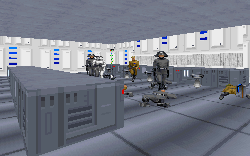

*I raced down the canyon, data tapes in hand and Madine struggling to keep up. Behind me I could hear the shrill scream of the trandoshans and the equally shrill shriek of their concussion rifles. The walls of the canyon were exploding all around and I was wondering if the corridor of stone would ever end, when suddenly the Crow came into view ahead just beyond a ledge. With a final burst of speed we reached the ledge, and jumped aboard the ship, escaping just ahead of the Imperials and their bounty hunter hires...*

Allright, it didn't happen exactly like that, but it could have. Perhaps it was because the soundtrack in the stereo was reaching it's climax, or maybe just because I'd had a good day, but the ending of this level was incredibly intense for me, and was a great way to cap off the level.

To start off, the author gets a C- for creativity with regards to the story. This is something that we've done time and time again, and I can't think of a level that has been able to top the LA version. This one doesn't. But despite the story, the level comes off pretty good. There's a nice mix of enemies thrown around, a couple Phase 1s to keep you on your toes too. You also get a tremendous amount of ammo to use, but the author doesn't make it conspicuous, and I actually found myself needing a lot of it. You'll also find a lot of nice areas in this level with good attention to texture placement. And I have to make sure to say that there are several unique ideas here that keep the level from getting boring. I especially liked how the author made the water under the hovering shuttle move to show evidence of the repulsors. Little details like that combined with other features keep your attention off the ammo and make this level more than just another shoot-em-up.

The level ultimately dies out when it comes to architecture. There are a lot of problems with design. Outside the fortress the rock ledges are very obviously placed as stepping stones to allow you access to certain areas, and other ledges are set apart from the cliff or doorway by a small fraction. I don't know if this was intentional, but it gives the level the appearance of being slapped together. Once inside the base there are a few problems with textures when it comes to crates and consoles, but the real problem is again the design. Almost everything is very blocky, with lots of 90 degree angles. This makes it easier to line things up, but also makes for a very monotonous level, epsecially when there isn't much new to keep the players attention.

Switches are also a problem because it feels like everything in the base is controlled by switches that you have to locate and throw. This makes for a realistic level but not for real fun gameplaying. After a while it gets boring.

## Overall

Aside from the general blockiness of the architecture, this level comes off pretty good. Lots of things to shoot, some puzzles to figure out, and some surprises that should keep you interested. I still think that having to run around the cargobay blowing off the side of crate after crate looking for... something... is a lot of fun and makes for good tension. I would suggest trying this one out.
