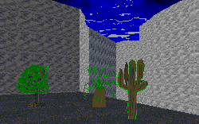

This level has an interesting premise. The author has apprently gotten sick of being Kyle all the time and introduced his brother, Ken. That's fun, and it allows him to write a decent story. However, because he doesn't carry through with the same amount of detail in the level as he puts into the story, the whole thing is pretty much a bust.

For one thing, the level is incredibly short. And there's not even a single puzzle for you to deal with. Your path is set, you follow the route, grab the hostages, and in about 60 seconds you're all done. Not what I'd call a good use of my time.

The author describes this as his attempt to see if the teleporter chutes could be used in a realistic manner. He suceeds in finding some interesting ways to use them, but it's very obvious when they're applied, so it spoils any realism he might have otherwise established.

## Overall

Aside from the interesting use of the teleporter chutes, this level really isn't worth your time. If you're a author looking for some ideas on the use of the chutes, you might take a look. Otherwise don't bother.
