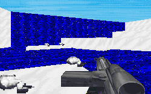
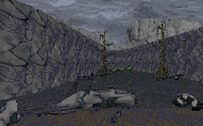

I am a huge fan of Timothy Zahn's Star Wars books. Actually, that's a very large understatement. Personally I believe them to be the only works to capture the same spirit of the original trilogy. So I have to say I was both excited and disturbed when I downloaded this set to review. I could find one of two things: I could find a great series of levels in which the author does a fantastic job of telling the story, or I could find some levels which squandered a big opportunity.

Much to my dismay, I found the latter. These levels suffer from a number of problems, and all of them originate from a failure to adequately make use of and pay attention to the story provided the author. The story does seem to stem from the premise of the novels; you need to stop Thrawn from massing his fleet. However the first problem is that these levels negate everything that occured in the books, because they begin and end before activities in the books even start. Thrawn is taken out of the picture without any mention of C'Baoth, the clones, the Katana Fleet...... there could have been so much done here.

Aside from major story conflicts, there are other discrepancies. The first is an absolute lack of attention on the authors part to the levels he was creating. The Hoth level seems to have a large, deep blue river running through it. Now maybe this looks nice, but LucasArts even set up specific textures so that rivers on ice worlds would appear cold and icy, not warm and inviting. I also have a feeling that any water on the surface of Hoth would have been frozen a long time before Katarn could ever reach the place.

Other examples of this are present in the remaining two levels of the set as well. Endor probably suffers more from this than the others. When you set down you immediately hear all kinds of noises, and notice lots of new detailing. This is nice except all the new things seem to be set up for a swamp! There are chirping noises, burping and squelching noises, and the trees look like they've come straight out of Dagobah. You can even find dark swampy looking water running all over. Nowhere is there a hint of the massive trees and shrubs that were so obvious in Return of the Jedi. And there was also not a single Ewok in the place. A biker scout and speeder bike does not the forest moon make.

The Chimaera also has similar problems. The major one being that aside from the bridge, there is no hint at all that you are on board a Star Destroyer. The architecture is random, just a bunch of boxes linked together. I would have expected a little more, noting the many other Star Destroyer levels around which took clear advantage of the architecture. I also noted a distinct lack of any ysalamiri on the bridge....

My final big gripe is the ending of the levels. In case you couldn't figure it out, you're sent to kill Thrawn in the last level. You reach the bridge, and bang, one blast strikes a white-clothed figure dead center. He crumples, and the entire purpose of the level is over. It's a total let down. You would think that he might at least have some armor, or you might need to go through some Noghri first. It's an example of the ease of these levels, a major flaw. Puzzles aren't difficult or inventive, and there is no real opposition for you to face. At least he managed to keep the Dark Troopers out of it.

There is a lot of new stuff here, as is readily apparent from the specs below. Some is good, some is bad, and some I probably didn't notice. The new stuff is great, but it can't save these levels. You can't add a whole bunch of new stuff and instantly expect that people will love the levels for what's new.

## Overall

If these were levels with any other story, they might have done alright. They come across as pretty average, and with major conflicts between the story and levels, not to mention the numerous possibilities the author overlooked, they just don't show you anything. If the name Thrawn is just there to get people to try the levels, the author probably succeeded in his goals. But I really wouldn't bother with these if you haven't already.

