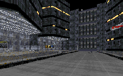

As Part II in a trilogy, this level had something to live up to. In true sequel fashion, it doesn't quite match it's predecessor.

Coruscant has been done before. So in order to keep everything consistant, the author follows the examples of the levels that came before him. Lots of the textures are the same, and so is most of the design: large, close packed buildings that all look alike. That's Coruscant. There are some new areas that add a little life. The bar is nice, with people sitting around rather than trying to kill you. The band is also a nice touch, flashing lights and everything. But it's a bar, and we've seen that before too. The same textures are there, and while the music is new, the idea is old. Basically it all looks the same on the outside.

Besides the lack of original ideas, there are a number of logical problems that persist. I fail to understand how an area which has had its power cut(the lights went out) still can move an elevator and open doors. I also don't see the point of locking a door only to have the key to it sitting in an adjacent room. It's just a little annoyance, not a challenge or a puzzle.

What the author excels at, in this level and his last, is storytelling. He allows characters in the level to tell the story as it goes along, and you don't know everything when you go in; you need to pick it up as you go along. The author also does good stuff on the little things. Nice elevators, alternate escape routes, and great skyline views are all good examples of things the author has put work into. They all add a new dimension to the level and the story, keeping it from bogging down. Another thing to keep the level moving is the good population around the city. Lots of troopers scour the streets, as you'd expect. The Dark Troopers are understandable(this is Coruscant after all) and the author uses them in good fashion. I'm also glad he had the sense to stay away from the Phase 3s.

## Overall

This is a good level, and it's fun too. It continues the story started in Part I, and does a fine job with it. The reason it suffers is that most of the stuff isn't incredibly original. But you should try it anyway.