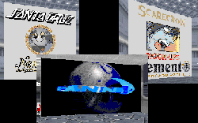

This author has accomplished something I never thought was possible. It had never occured to me that somebody would go to this much effort just to advertise. The author has populated his level with logos, slogans and other images in an effort to promote his favorite skateboarding companies. This entire level is a joke, and I don't regulate that to just the "art" on the walls.

There are some real problems here. The largest is the utter lack of goals to accomplish in the level. You can guess for yourself what you should be doing, but once you get a quit message (of which there are two, in different parts of the game) the game isn't over. It would seem that the author didn't manage to properly set the goals for his level. I also noticed several areas in the crawlspaces where the walls flickered, revealing false rooms or textures. I don't know what the cause of this was, but it stopped me for several minutes while I tried to figure it out. No level should interrupt gameplay because of a flaw. And if that wasn't enough, Boba Fett and a Phase 3 DT make appearances, for no apparent reason. Since the author failed to supply a story, I can find no justification for their being in the level.

I always try to find something positive about a level when I review it, and (this may be a shock) I didn't have to look far in this level. The author has made good use of VOCs to add some character to the level, and there is a nice view overlooking a landing platform with Slave I sitting outside. I get the feeling the author might have done a good job if he'd made an effort to build a real level, and not just a showcase for skateboard advertisements.

## Overall

This level isn't worth your time to download, much less to actually try to play. If you want interesting examples of new textures or ideas, yes, you can find them in Galleria. But you can find better ones in other levels too, plus one other item you won't find here: decent gameplay.
