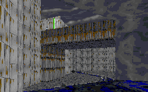

This is a set of three levels, and probably one of the best things it has going for it is the continuity between the levels. I'll review them all at the same time, but each of the levels is very different. This is an excellent continuing mission and just about everyone will want to download it.

In the beginning of the levels, there is a new scrolling text, and a new cutscene, which is always a nice touch. There are also new briefings. The first level starts with you in a prison cell in the detention center of Outpost D-42. To escape, you have to crawl out through a grate in the back of the cells and crawl through an intricate set of sewer canals. I don't particularly like having to deal with sewage and dianogas, but this area of the level is very good looking, with a well-planned circular layout. After you find some explosives and bust through one of the cell walls, you wind up in a circular room with doors all around it to lead to crate storage rooms and other detention blocks. This is probably the main drawback of all three levels, though: repetitiveness. While they are still good levels, they often have several virtually identical areas, and this gets tiresome. Case in point, as elevators take you to several other circular rooms with similar layouts. Finally, though, the monotony is broken as you finally make your way through some barrack and control room areas, plant a sequencer charge in the base, and escape in a TIE bomber, after first taking care of some difficult competition. All in all, a pretty good level.

But your mission isn't over yet. You still have to make it into the outpost's TIE fighter hangar base to recover the Crow. With this in mind, the next level starts with Kyle landing (and abandoning) the bomber amid the cliffs on the planet surface, which is a pretty creative way to start a level, in my opinion. Like the first level, this one is huge, and, unfortunately, a little repetitive, but not too much. There is a good use of a gray cobblestone texture to form a main troop road that you find after trekking through the mountains for a little while. Following the streetlight-illuminated road, you must then make your way into various checkpoint bases to gain parts of a code that will let you gain access to other areas. There is a neat looking bridge over a deep chasm, and a nice texture that gives the windows little streaks on them, to give the look of light reflecting off them, and also to let you know that they are, indeed, solid glass. After all these trials and tribulations, the level ends at the entrance to the TIE base, and a very nice-looking entrance it is; the author's talented design has shown through again. Once more, the level ends with a bang with a fight between some enemies (including, like the first level, some Phase 1 Dark Troopers). The author had every right to put some Dark Troopers in here, and they go well in this area, not to mention ending the level nicely.

The third, and probably the best level begins where the second level ends. Kyle stands in front of the base, the bodies of his enemies around him. The author cleverly sets up invisible walls to prevent you from going back to the areas of the second level, which of course would have made the level far too big. Unfortunately, the many doors at the entrance of the base are locked, and Kyle must blast his way through several layers of solid rock in order to enter a ventilation shaft (another great, original idea!). From there, this excellent level has many interesting areas and enemies in it, and a plethora of new WAXes and 3DOs, such as an ATAT walker, various TIE spaceships, Speeder bikes, and Scouts, ATAT drivers, and TIE pilots. And this leads to the big thing that makes this level great: detail. The fact that this base has all these components is exactly what you'd expect in a large, fortified base. The ATAT and the TIE fighters have platforms or elevators to take the pilots into the cockpit. I think this is the first time that such attention to detail has ever been in a level. The largest entrance door of the base is for the ATAT walker, and next to the walker is the garage where the speeders, and the scouts, are waiting to scramble at a moment's notice. There are, of course, large barracks areas where the new WAXes can be found, and crate storage areas. The repetition of architecture is now down to near nil, with many fresh and original ideas now dominating the level. There are many floors to the base, and many different elevators-freight elevators and normal elevators-to take you to the many floors.

After planting a charge in the base, shutting down three tractor beams that are holding the Crow in the large, very neat-looking hangar bay, and surviving the many enemies, Kyle finally heroically escapes in a great finale. There is also an end cutscene with the author doing a voiceover, which is nice.

## Overall

All in all, this is a wonderful, clear-cut storyline, and three wonderful levels that will provide a lot of enjoyment.
