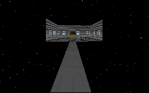

This is a level that should have succeeded. There's a cool story behind it that would make for some great action and fun in the right hands. But this level fails to execute, making some pretty obvious mistakes and also not taking advantage of several opportunities.

The first problem stems from the architecture and the texturing. The base consists of 6 levels all roughly vertically stacked with lots of 90 angle rooms set together in what appears to be a random fashion. This by itself is enough to make most players cringe; there's no variety in the level. This is furthered by the boring and slipshod use of textures. Textures go wherever the author seems to feel like putting them, regardless of the function of the room(most don't seem to have one, they're just acting as a place for the player to move through) or whether it works with the other textures around it. Sometimes the texturing is absolutely hideous. In a problem combining the faults of architecture and texturing, there is rarely any interruption of the straight walls, just texture flowing from end to end. Very quickly you stop looking at what's around you and let your mind fill in the blanks; you just concentrate on getting out.

Some things that I think were missing in the level: a bit of creativity would have been nice. The base is set inside an asteroid, so why not let us see some of it? Some rock protruding from the walls, or perhaps a control tower above the surface where you can look out at the cratered landscape would have been nice touches to let you remember where you were. As it is you can see into space sometimes, and other times you see much more space than you should: as in the asteroid and the base are missing completely. Another nice touch would have been to add something other than the switches to let the player know the bomb was set in the wall. Perhaps a small alcove covered by glass which you could look through to see the bomb you were disarming. The switch on the wall destroys any hope of concealing the bombs existence, so why not make it cool while you're at it?

This level still manages to provide a run for your money though. There are enemies everywhere thanks to numerous generators. You get every weapon in the book to deal with them so it's not a question of whether you will survive, but rather how long it will take you to get there. Boba Fett and some Dark Troopers are included for no reason at all, along with lots of Bounty Hunters that really have no place in an Imperial base; my view is that the author made a desperate attempt to add some interest to the level. It really doesn't help much, especially when there's no need to confront them; if it becomes too tough you can run away.

The corridors you have to run through are very confusing, connecting here and there until you need to take a good look at the map to regain your bearings. I view that as a detractor for the level, since a base is usually orderly and organized. Others might enjoy the mazelike quality.

## Overall

There isn't much else that can be said. The level is very boring in most parts and in others it's just confusing. The story could be recycled into something interesting, but I don't see there being much that can be done for this mission.
