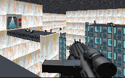

This level looks good. I mean that literally; the author has spent time going over the place to make sure textures fit and 3DOs are positioned correctly. And the choice of textures is pretty good too. There are a few new ones in addition to the dozens that have been modified to give the base the cold blue look you generally associate with ice. It makes the base feel icy, and it almost makes a shiver run up your spine.

There are also several large open places where there is a lot of detail and a lot going on. And in most of these places I couldn't detect any HOMing at all, and only small bits of slowdown. In their anxiousness to fill the level with all kinds of things and set up cool looking architecture many authors don't take into account what the level will play like and when we get it there could be HOMs galore or slowdown enough to bring any action to a standstill. But here the author has provided elaborate areas with out sacrificing any gameplay.

That said, there are lots of problems with the concept of the level that should be addressed. The idea of needing to take out the shield for an attack is great. No more hitting a self-destruct switch or bringing the base crashing to the ground by yourself; this time you get to do it in a more feasible manner. Unfortunately the level doesn't carry the story over much. I would have liked to see some radio updates to keep you appraised of the attacking fleet's progress toward their goal. But you carry out your mission in silence, without any sense of anticipation of the attack or the need to get your mission done quickly so the bombardment can begin.

There's really no way you could get the job done in a reasonable amount of time anyway. This level is large and the author has managed to make the whole experience even longer than it should be. If you know exactly where you're going and what you're doing I'm sure the level would go by fairly quickly; this is undoubtedly what the author went through as he tested it. But if you don't know what you're doing you can find yourself traveling all over the place, running through areas time and time again in your efforts to find the next piece to the puzzle. I don't remember the last time I was so frustrated by a level, not because it was difficult to figure out but because I needed to cover the same ground time and time again to find what I was looking for.

The architecture in places leaves something to be desired as well. In order to make everything fit on a map the author has designed long, drawn out and winding corridors for you to run through. The problem is that no Imperial base would be constructed like this. There's no sense of order to the layout and you get the feeling the hallways are laid out just to give you something to do. It's completely unnecessary.

## Overall

I could go on about other parts of the level that annoyed me, but it would be pointless. The real point I'm trying to make is that lots of areas feel set up, made up, and they didn't provide me with a really enjoyable time. Parts of the level are really cool, it looks good, plays allright for the most part. But the middle is so dragged out you might feel better stopping than finishing. Overall it's a so-so level, but nothing to rush out to grab.
