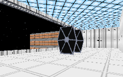

It sounds simple enough. Just break into a Star Destroyer and steal the Death Star plans. Piece of cake right?

Wrong. The level is pretty simple to figure out, and you shouldn't have any trouble with the troopers in here. But the Star Destroyer is nowhere in sight.

I can hear what you're asking: "Did I hear that right? No Star Destroyer? But I played it and it was on a Star Destroyer. And the text file says..." Well the author seems to be under the same impression you are, that this level takes place on an Imperial Star Destroyer.

But if that's so then this is the oddest Imperial Star Destroyer I've ever seen. With complete disregard for anything Imperial we've seen before, the author charges ahead with his plans. While walking through you won't find anything that even remotely resembles what is generally accepted and is in print. You might also wander over the entire area looking for the same type of coloring or texturing that we saw in the movies. But that won't be here either. Instead the ship has been replaced with white-walled rooms from a Corvette, black corridors streaked with yellow, nice red lit floors, and a very interesting grey and orange exterior. You might also note the lack of a realistic hangar bay(the closest thing seems to be the size of a large hallway), the abscence of the regular uniform architecture we associate with Star Destroyers, the apparent oversight that left the ship without any turbolifts, the addition of a new landing pad on TOP of the ship, and the interesting closets that seem to pose as rooms now. This monstrosity that the author has wrought is not, I repeat is NOT, an Imperial Star Destroyer.

That aside, even if this level took place somewhere else it would still fail. The architecture is small and constricting. While that might make sense for a ship, Star Destroyers are built on a very grand scale and even if this ship was a submarine I'd still expect room enough to walk around all the time. The plot alone practically dooms this level to mediocrity, but the setup doesn't help. Enemies are confined in small rooms and you spend most of you time moving up and down elevators placed in the most obscure places. Basically you run a maze, and I'd expect any type of base or ship to be a bit more orderly.

## Overall

There is no doubt that the level is pretty much a failure. Had the author tried a more interesting plot and combined it with some more accurate and involved architecture it could have gone somewhere. But as it is this level just tends to sit and flounder; it certainly isn't much fun.
