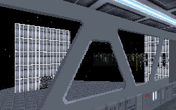

The plot is an interesting premise, and the level does a satifactory job of executing it. But there's a real problem with this level and that's that it doesn't reach out, grab you and make you say wow at any point during the mission. It's a pretty regular level.

There are plenty of ideas to go around in here, and several are done with some creativity. The walkway that lets you look out over different platforms is pretty good, though the windows are really too high to let you see much without jumping. There are also signs throughout the facility to let you know where you are. The ballroom, the kitchen, a dining room, a theater; the area is fairly well laid out with the different areas you'd expect in a recreation facility. Another nice touch is the use of chairs with each table, creating a desk where someone could sit, rather than just a block that somebody would stand next to. It's a subtle touch, but it adds something not immediately detectable to the level and shows some attention to detail.

Other parts of the level suffer from the common errors. The whole place is blocky in design even though texturing is pretty well done. The placement of enemies and generators sometimes leaves you wondering whether the mission is supposed to be a trap. But you never get definitive evidence either way. I'm also curious as to why bounty hunters are running around an Imperial recreation center, especially with the sensitive material that's easily accessible in the facility. That's an oversight a lot of authors fall prey to, and this one is no different.

## Overall

The lack of anything to set it apart from other missions regulates this level to mediocrity. Not bad by any stretch of the imagination, but certainly not in the upper tiers when it comes to rankings. So give it a spin when there's nothing else to do. But don't worry if you don't download it right away.
