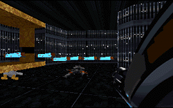

Well, the story that the author has written is confusing but still interesting. Up to now all the levels have focused upon the present or the recent past. This mission takes us back to a distant time; one could say 'A long time ago.....'

But the author seems to have concentrated too much on his story and not nearly enough on his level. The absolute minimum necessary for a level to be called new exists here. What's he's done is take the Imperial City level from Dark Forces, remove some of the Dark Troopers, replace others with Darth Vaders(possible Sith lords) and Boba Fett with an Officer. The Stormtroopers are also now Mandolorian Warriors, the Commandos Cloud Car Pilots and the Officers wear black. That's about it. It's all pretty ridiculous, watching Boba Fetts slide along the ground and shoot lasers from their foreheads and running through a level where you know every twist and turn before hand.

The author has also included about a half dozen VOCs and some new FMEs whose main purpose is to balloon the size of the zip. The droids are a welcome addition, but the VOCs are only confusing and annoying; just lines from the films repeated over and over. How many times must Vader tell us our destiny lies with him? Blah, blah, blah, you're fifty odd years in the future, give it a rest.

## Overall

Bottom line: if you're going to try and tell a great story, do it right. You can write all you want, but without a decent mission a story is worthless. Maybe I love a good plot, but if all I want is to read a story I'll get a book, not suffer through a terrible level to get it.