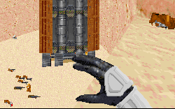

"The Jundland wastes are not to be traveled lightly." - Obi-Wan Kenobi

No truer does that ring true than in this level. There's no city where you can meet people, no ship to pull you out if things get bad. It's just you and your platoon(some dewbacks, but they don't count) against the Jundland wastes. And that includes all of the inhabitants as well. The author has done a very nice job of recreating those few scenes we saw in ANH, and uses the stuff he's been supplied with in junction with his story and new materials.

One of the nicest things about the level is the opening portion. You open onto a scene of the rest of your platoon atop dewbacks searching the desert, and you get the order to move out. After some searching the information comes over the radio that other troopers have located the crashed A-wing in the other direction. And so you rush off to join the others. This is an incredible example of a very simple but effective way to pull the user into the level. It takes what could have been a very frustrating and confusing search into what feels like a team coordinated action. A possible step towards the multiplayer team stuff we could see in Jedi Knight.

The level after that tapers down a bit. You get to search through what seem like endless corridors and canyons, lots of small caverns for the plans, eventually coming upon a Jawa sandcrawler. The crawler is really well done, small and cramped on the inside like it should be, with some nice exterior views as well. But it feels kind of lifeless and uneventfull. Once you get over the initial excitement of fighting for the Empire and that nice team bit, the level doesn't have an incredible amount of other stuff to offer. What it all boils down to is a search through the sandcrawler and the terribly confusing wastes for the plans, and there's nothing else to grab your attention. The jawas keep coming and coming, there's no end to the little guys so there's not a question of not having things to shoot. But it isn't tough to get through, just rather annoying.

One of the things that contributes to the problem is the setting; you're working in the Jundland wastes, and that means there won't be a lot out there. It's a lot of rock, sand and grit that's all very similarly colored; by the time you get through you're sick of the color brown. But I don't think the author could do much about that. It's due to the nature of the surroundings, and the way it's presented is just how it should be. In that the author succeeds, but it doesn't help make the level interesting.

## Overall

The Jundland wastes are a very boring place to be, and the Jawas certainly aren't the most interesting or toughest opponents in the world. That's the way this level is and that's the way it should be. So give the author points for accurately depicting it; it still doesn't come off great. But you have to admit it's certainly different and that's a nice change.
