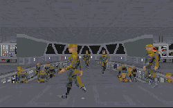

First, the obvious: the plot is nothing more than a way to get Vader into a level. The rest is there to give it some validity but it violates so many constants in the Star Wars universe it's unbelievable. Apparently this takes place before the Battle of Yavin, when Vader and the Emperor are hunting down the Jedi Knights. Of course Katarn would still be in Imperial service at this point; and why Vader only merits a Victory-Class Star Destroyer with no escort is unknown. The good news is, after the first few steps through the level, most of the plot is forgotten. The level envelops you in the Star Wars universe, and there's really only one thing on your mind: Vader.

In his text file, the author gives credit to the Star Wars Technical Journal, which he says he used constantly for information. It shows. The level consists of a Star Destroyer, nothing more, but this Star Destroyer is incredibly accurate. Granted, it doesn't encompass what would be an entire Star Destroyer (there's no commercial PC that could run a level that large and detailed) but it does do a fine job. There are crew quarters, separated between officers and stormtroopers, along with rec rooms, bathrooms... the list goes on and on. The amount of detail and creativity put into this thing is astounding. At times you feel like stopping the action and just taking a tour of the grand facility provided for you(which is fun!).

There are also several items that Star Wars fans should be familiar with. The Star Destroyer comes complete with an accurate bridge, where you can look out of the standard windows over the rest of the ship, and next door is a holographic display complete with rotating TIE. I felt like I'd stepped into TIE Fighter. The bridge area even has a pad for Vader to communicate with the Emperor, straight out of ESB.

For you to get around the ship, you need the standard keys and code cards, but the author has managed to get around the usual dreary business by giving you the afore-mentioned areas to explore. You pick up the keys along the way, running through this maze of corridors and rooms to find all kinds of secrets. The eventual goal is to reach the captain, who has the key to Vader's private chamber.

Of course all of this is leading up to your confrontation with Vader. And this is where the level slips. Vader is really just a Phase 1 Dark Trooper, and as such is way too easy to overcome. The VOCs work great, with a humming lightsaber and the characteristic breathing, but without a challenge, I felt disappointed. The author is aware of this, and wishes it could be otherwise. But it would be very difficult, not to mention illegal, to hack into the program. However, there are always alternatives.

It's difficult to find something to gripe about here, but I managed to come up with a suggestion. Despite what was done here, the author didn't use all that was available to him via the numerous web pages out there. I would have expected to see some grey shirted officers on an Imperial ship, or perhaps some stormtroopers without the helmets (I think there's a WAX for that) in their quarters. If the author wants to take this a step further, there are numerous areas where one more little item would increase the experience a lot. Dare we hope for a second version?

## Overall

If you haven't downloaded this level already, do it now. I have yet to find a level to so completely immerse me in the surroundings. All the parts of Dark Forces you could possibly want are here, from the shootouts to the puzzles. Vader's a little easy, but once you get over it there's plenty more to grab your attention. My congratulations to the author on a job well done.

----------

Recently Peter Klassen released [some cutscenes for this level](/missions/kilvadercut.zip). Having tried them I can definitely recommend them. While they don't make the level any more fun or interesting they do add another dimension to the experience, completing it in a way.