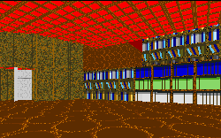

The failure to find a story is a serious detractor when playing anything. However, I don't think that the best story in the world could have saved this level.

You begin in a detention center for some reason, use the standard methods to escape and then need to make your way through a maze. For the most part, it consists of running through dark, narrow corridors, flipping switches to allow yourself access to other areas. This might be interesting if all you're looking for is a maze to find your way through, but when you have all the tools of the Star Wars universe at your fingertips, I would expect a little more from the author.

Apart from being monotonous in geometry, the level suffers because you never really find anything new and exciting. The textures are all the same, the whole place is dark, and most of the ideas are recycled. What's the point?

One of the things that I find the most disturbing is that the author readily admits that this level has several flaws. The WAXes are incomplete(and not of incredible quality either), waterfalls don't scroll, sounds jump around, and some elevators don't work. To top it all off, it crashes immediately after you finish, no matter whether you complete the level, die, or quit voluntarily. You've been warned. Personally, I don't see how anyone would be willing to release something with those kind of problems, things that should be easy to fix. If he couldn't do it himself, there are people willing to offer assisstance, and with the message boards and newsgroup available, there really is no excuse for letting those things get by.

There are some nice things in here, but they might be classified as unusual. One area becomes incredibly bizarre at a point. The rooms might be more understandable if there was a story to go along, which brings me to a point I want to make. Does it really take that much more time to type up the story in the text file? I find it very frustrating when I can't find out what's happening in a level, either because the author didn't do a good job of explaining it, or something fails to work. A good summary in the text file would fix a tremendous amount of problems, and make the experience that much more enjoyable.

## Overall

Other than being curious about some of the more bizarre areas of this level, I can't find a good reason to download it. The geometry is boring, the textures are repeated over and over, and while there is new stuff, it isn't engaging or of exceptional quality. But the link is below if you want it anyway.