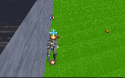

To my knowledge this was the first level to utilize multiple logic enemies. And going by this assumption I can therefore say that it was this level which started what has become a serious scouge in add-on levels.
The use of multiple logics is a way for people to create what can be referred to as new logics. Seeing that nobody has to this point created a brand new logic for a character, or for that matter figured out a feasible way to do so, the discovery of multiple logics has provided a way to increase difficulty for levels by making enemies fire faster, move faster, and be able to use several weapons at once. For instance a stormtrooper could be given stormtrooper logic combined with gran logic so that the trooper would fire a rifle and throw thermal detonators. There are lots of combinations that let an author go beyond just switching logics between characters.

In *Kyle's Nightmare* the idea works wonderfully. The level is set up as an arena and you're provided with your weapons and some protection before the assaults begin. The enemies you face are set up with numerous logics that make them move at pretty incredible speeds and fire their weapons at an unbelievable rate. These guys are tough and the author's claim that if you can beat the level on hard then you are a true Jedi is founded on solid ground. With one slash a Phase I Dark Trooper can drop you like a stone and Phase II's can blow you so high that even if you survive the explosion you won't survive the fall back down. The whole level has a very dreamlike quality; it embodies that feeling that nightmares always have, where your fears are multiplied and expanded upon until they seem unconquerable.

But this quality doesn't apply to other levels. The wonderfulness of multiple logics has been greatly overstated. When characters can shoot or throw TDs at you and the image doesn't respond in accord(the WAX doesn't use that frame that's set for weapon discharge) there's something wrong. Well, technically the game is responding just the way it should in this case, but it ruins any firefight you're in at the moment. Also enemies with multiple logics can continue to fight and run around for some time after they've actually been killed. And when they finally drop to the ground they might fly across the room as if blown away by a mine. Or they might just collapse and then give off as many powerups as there were logics combined in that character. To be given a concussion rifle, a string of thermal detonators and several stormtrooper rifles seems a bit silly, don't you think?

## Overall

I'm sure everyone can tell my opinion about multiple logics. They're not bad, but they're not the incredible tool that some people like to make them out to be. They should be used with care and in certain situations. Otherwise they end up making the mission look foolish. For this level they work great, and if you haven't already you'll want to download it for a few minutes of fun/frustration.
