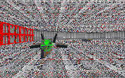

Two rooms connected by one large door. Four enemies. The Crow sitting on the ground with a holographic Death Star imbedded in it. Horrendous texturing on the walls, floor and ceiling. A few items lined up along one wall.

You've just received a complete and accurate description of what the author seems to think is a level. It looks to me much more like what came out of improperly following a WDFUSE tutorial. I've seen some levels that I thought were really bad. And there were some that didn't consist of much more than a bunch of square rooms connected by hallways. Maybe there was the occasional landing platform outside, filled with Dark Troopers. But this level takes the cake. I'd have to say that the only thing that could make it worse would be to have the plans sitting in the same room. Oops, guess I just gave away the big secret didn't I.

## Overall

I'm not going to waste time on this level. It just isn't worth it. Suffice to say that it's about the worst level you'll find sitting out there as of this date. Please save yourselves and stay away from it.