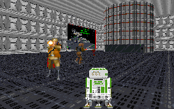

This level sounds pretty average, and that's really all it turns out to be. While the story COULD have provided some really neat sites if used properly, perhaps, say a really cool computer core or maybe a well thought out construction facility where we get to see the various stages of DT construction(something we never saw in Dark Forces), instead the author squanders his opportunity. He focuses on infesting the level with lots of traps designed to kill the player. It feels a lot like he's decided to make it the most difficult level anyone has ever played. He's partially succeeded, since I didn't make it through the first time, but after one time through it isn't tough. What he's really done is forgotten one of the objectives when creating a level: to make the experience enjoyable for somebody else.

The entire area is not poorly designed, but there are a lot of problems besides the author's intentions. Textures may be lined up pretty well, but I found that in many areas the same texture continues without interruption for a long time. This gets boring real fast, and doesn't look good, especially in large open places that could use some variety. Often smaller textures are used to fill up huge walls that should be using larger textures, which doesn't make it look accurate structurally.

The author also seems to have decided to put in just about every WAX, FME and 3DO he can get his hands on. This doesn't make much sense, and really only serves to balloon the file size to gigantic proportions. If he'd used them nicely, or bothered to replace some of the VOCs for the enemies, I might be able to say otherwise, but most of the FMEs seem to be sitting below the floor. This doesn't make them invisible, but they sure do look weird. Same thing for the X-Wing at the beginning. I also am not a huge fan of blowing away about a half dozen Grand Admirals while I'm running through the level. If I'm correct there were only 13 counting Thrawn, right? Looks like Kyle has just wiped out half of the strategic masterminds of the old Empire. A little hard to believe.

The only thing that saves this level from becoming just another wasteful shoot-em-up is the difficulty of it. It is tough to make it through all the traps laid out for you, and while it may not be much fun while trying to play the level, there is something to be said for testing your skills on this mission.

Overall

69%This level might have a few good points, but for the most part it's just a large waste of time. Perhaps somebody will pick up the story and make a decent level out of it. But I wouldn't waste a substantial amount of download time on a level of this poor quality.