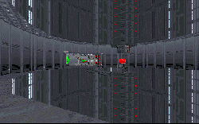

This is just one of the levels to attempt to construct a death star, but it's by far the one that succeeds the most. Complete with an accurate detention center, trash compactor, and the hallways and chasms we found in ANH, this level has every ingredient that makes up a good level. Even the plot is sound; it makes sense that the Imperials would not let Kyle escape so easily, and this idea fits in well with the story supplied by Dark Forces. All DF says is that Kyle delivered the plans to the Rebels; it doesn't mention any troubles he might have had along the way.

This level is also not that easy to get through. You start off without any weapons, hard enough against a single Kell dragon, but surely deadly in an Imperial detention center. After appropriating some weapons, you get to make your way through a station filled with troopers. There are generators to keep them coming so the action never stops.

There are a few little details I noticed that seemed out of place. Whay is the door to my cell unlocked? And why can I open it from the inside anyway? This is a question we could ask of Dark Forces as well, but it's made worse when you are meant to be a prisoner placed in that cell. I also would have expected the Death Star to have a few more troops in it to throw at an intruder. It's tough as it is, but the whole place seemed a little sparse to me.

## Overall

The author has done a great job on this level, compiling many of the places we love from Star Wars into the plot, and still managing to keep the story within reasonable limits. This is one level you won't want to miss.