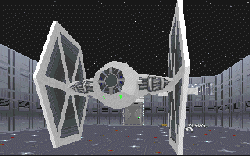

When I started this level, I was geared up for a good time. The plot seemed sound, not incredibly elaborate, but simple and concrete. It promised action, toxic areas, some machinery, and plenty of enemies to mow down. There was no mention of the dreaded duo, Dark Troopers and Boba Fett, so I figured this might have some thought put into it. When I finished, I was disappointed. It wasn't a total bust, but it left me thinking the author didn't run it through enough tests.

The level is large, with lots of areas to explore, and different settings to keep it interesting. The textures seem to fit in place: in other words, a toxic dump looks like a toxic dump, and a control room looks like a control room. And there was even a cool new TIE Fighter 3DO, with textures taken from Dark Forces to enhance it. But there is something about this level that bugs me.

Maybe it has to do with the plot. It's simple, and could fit in anywhere in the Star Wars time line. But that's all it is. It's pretty unimaginative, which is really where the level fails. After the initial excitement of finding the TIE, the level let me down. The basis is nothing more than another 'find the keys, blow it up, and get out' deal. And there's nothing that ticks me off more than being forced to trek through a place I've already been after going a way required to finish the level. The general setup of the facility makes no sense. Why have a huge expansive corridor running through the middle of a toxic plant? And why is the switch for the machinery concealed in a room only accesible by jumping out of an elevator shaft?

The worst part about the level is that it's impossible to finish without cheating. The last key is contained in a room high above the ground, and there's no way in or out except via the LAPOGO command. The author claims the level is possible to complete without using a cheat, but I searched high and low, and couldn't find any secret to enable me to make it up there.

## Overall

I wouldn't suggest bothering with this level. The architcture is lousy, the plot unimaginative, and there's nothing you can't find somewhere else. It's not that it feels slapstick, it just is poorly done. If I'm wrong about it being impossible, somebody email me, and I'll take another look at the level. But until that happens, the rating to the right says it all for this one.
