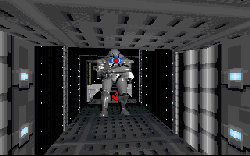

This level takes us back to Return of the Jedi. Apparently the Emperor has stockpiled the last of his Dark Troopers, and is preparing to use to stop the Rebel attack on Endor. This seems to bend several of the storylines in ROTJ, but it's only bending. This level is fun, and it gives us a little history of what Kyle might have been doing in the years between the Arc Hammer and the upcoming Jedi Knight. The author uses the textures that we've come to associate with the Death Star to provide an accurate environment to work in.

One of the things I enjoyed the most is the author's use of messages to continue the action from the movies while you go about your business. Updates from Endor serve to add urgency to your quest, and also help to make this new chapter of the Battle of Endor find its niche.

This level is not without shortcomings however. It appears that Kyle snuck in via a shuttle before the battle outside began, which explains how he made it through the shield. But how did the Emperor intend to get the Dark Troopers down to Endor without lowering the shield in the middle of the fight? I don't think he would have chanced even one Rebel fighter getting through to the Death Star. Regardless of that, I have to congratulate the author on not succumbing to the temptation of having Kyle blow up the Death Star. I realize this must be an obvious opportunity for the Rebels, but one has to stay within the boundaries set by George Lucas and Co.

## Overall

This level is fun, and the story is creative as well. The author has found a way to use Dark Troopers as a part of his story, not just an addition. There are some things I can be really nitpicky about, but the bottom line is that I had fun while playing.