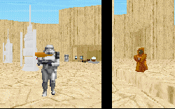

I'm sure that it was bound to come that somebody would create a level on Tatooine. After, the planet figured rather prominently in the first three movies and promises to do so in the prequels as well. What wasn't bound to come was a good level out of it; after all, just taking a good atmosphere and slapping a plot on it does not a good level make. But here the author has managed to pull it off.

There are lots of new WAXes and 3DOs to help out this level. And the place really feels like Tatooine. You can almost feel a bead of sweat dripping off your face as you run through the cliffs and caverns. One thing that the author should be especially commended on is that he doesn't throw in a lot of stuff that isn't crucial to the level just for the sake of having it in there. Everything new has a purpose to it: to make the level more interesting and create a more realistic Tatooine.

There are generators present in this level to keep the enemies churning out, and that also keeps the difficulty high. But in a remote place like Tatooine, I thought the generators were out of place. It didn't make sense to have stormtroopers and bounty hunters appearing constantly. Maybe in an Imperial base, or a Star Destroyer there would be an ample supply of soldiers so to have them keep appearing is understandable. But in the middle of the desert and especially near Boba Fett's base of Ops, you would think that the number of enemies to confront would be minimal. I also would have preferred to need to figure out several puzzles in Boba Fett's base. Even though there is a booby trap, you can almost walk right in. I would expect a bounty hunter to have a little more protection than that.

## Overall

I felt this level could have used a little work. Once you stop ooh-ing and ah-ing about the new features and just being able to play in Tatooine, you'll realize the level seems terribly vacant. Even with Boba Fett(who we get to kill/stun AGAIN), the level isn't tough, and doesn't come up to it's full potential.