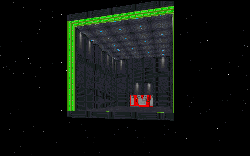

Where should I begin? The obvious holes in the plot(since when would the Empire sell one of it's SSDs, much less GIVE it away) or the problems with the level? Because just like the plot this level has quite a few holes in it all of which combine to condemn this level to the middle of the stack where it likely be forgotten soon.

The very first thing you'll notice is the new VUE. Not bad, but not great, especially when you discover you can see the ship sitting in space from the hangar door. Then imagine my surprise when I fall a few feet and find myself standing out in space. Without any life seeping away either! You can walk out in space just as is if it were a normal setting in this mission. Not the most auspicious start I've seen for a level.

The mission gets better from there until you reach another place where you can jump out the windows, again with no repercussions. But this time the windows don't even empty into the same area. As a whole the areas open to space only serve to reveal the authors don't really know how to work with exterior architecture when it comes to space. That's really too bad since the open areas looking out to space are the only really good looking parts of the level.

The rest is filled with blocky architecture and some pretty predictable occurances. There aren't any real outstanding puzzles since you just find the keys and run around the place setting charges. You get to shoot a lot of enemies including some Dark Troopers that have to reason to be in the level. Thankfully there's no Boba Fett which the authors could have pawned off as being involved in the war. At least they had that much sense.

One thing I think they really screwed up on involves the architecture. The claim in the text file is that the level is a new level from scratch. WRONG! There's one section that's clearly taken out of the Executor with just one texture changed and heights lowered somewhat. I have nothing against using pieces out of levels since often times it's just what you have in mind to make. And one could expect the Empire to have the same designs in places. But don't try to call it your own.

## Overall

This level has a lot of holes in it that an experienced Dark Forces player can pick out pretty easily. Perhaps we've just come to expect the best from levels nowadays, but this mission doesn't have anything special or new. It's an average level and as such will provide an average gaming experience. You get to decide if you want to try it out.
