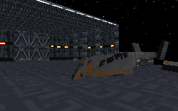

Shall we make this as quick and painless as possible?

You're there to find the Death Star plans, and as you go through you'll find lots of square or rectangular rooms filled to the bursting point with Imperial troops and droids, lots of uninteresting architecture with monotonous dark grey texturing, doors about 7 feet thick and 3 feet wide with crummy texturing on the faces, lots of switches to pull with no indication what they do, and the Crow sitting out on a platform in the middle of space. And all of this will be accomplished in just under 10 minutes.

There, that wasn't so bad, was it?

## Overall

Do I really need to say more? It's one of the older ones that failed to take advantage of the engine provided and certainly failed to make any type of positive impact on this reviewer.