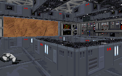

I think that we'll have to ignore the obvious misinterpretation of energy. After all, this is Star Wars, so physics and reality don't play as big of roles here as they might in the real world. And the level does just fine without all the accuracy in the world being shoved inside.

The first thing anyone will probably notice about the level is how great it looks. The architecture is really fantastic, and each and every texture is lined up just perfectly. I can't find fault with any of the display choices; everything fits just like it should and looks just like what you'd expect. The construction of the mine is also top notch. Massive areas of machinery and equipment and high tech devices to harness the energy flow are always present. And the author has also managed to make the place feel like a single unit. You won't find yourself thinking "here's the hangar part, and here's the tap part, and here's the outside..." All the parts have simlar architecture, starting with doors that all look about the same, and the author has also constructed a ventilation system that runs the span of the mine, not just the few areas you need to gain access to. And the new things the author has made fit in with the old material. You won't be struck or dazzled by anything new, but at the same time it will make an effect on the level that would be conspicuously absent if the items were removed.

You'll also find one of the finest examples of location construction in this level. Exterior shots look wonderful, and the sounds and other elements combine to make you feel as if you're looking out at a canyon, or standing at the edge of a cliff over the ocean, the sound of the waves breaking all around. It's really great stuff that I wish more authors would take the time to do.

But you shouldn't expect that because the author has put so much time into the look and feel that he's forgotten the action. There will be lots to keep you on your toes. Stormtroopers by the hundreds are guarding the facility and when you are discovered it only gets worse. You get just enough weapons and shields to make it fun and help you stay alive, but you don't have the toosl available to overpower the opposition. This ensures that you don't fall asleep at the keyboard.

If there was one thing that could have been improved about this level, I would suggest that a little more creativity could have been involved. The author takes cues from various other levels that we've seen, improving on each item and adapting it for his own level. You will be able to recognize certain things, and that tends to stop the pace for a little bit. The plot is certainly different, but it really boils down to just another facility to destroy. I would have liked to see a story moving along with the level, perhaps some alternative use for the facility is discovered, something like that. It could have added a different aspect to the usual method and given the level it's own distinctive quality.

## Overall

You'll have a difficult time trying to find a serious problem with this mission. I won't give everything away because there's lots to discover for yourself, but you can expect lots of new things, good puzzles for you to figure out, a reasonable level of diffocilty to overcome, and on top of it all a level that looks, sounds and feels absolutely fantastic. Try this one out right away.