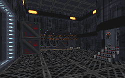

The first level does a great job, the plot being that Kyle must infiltrate the base where Jan is being held, find the detention block, and rescue her. The idea of doing a prequel is, in true George Lucas style, a great idea, and the plot is excellent to match. Everything is so thoughtfully planned out, with Kyle discreetly sneaking onto the planet, unarmed, and then buying a secondhand Bryar pistol on the black market, the weapon that will become his trusty standby. Another brilliant and realistic twist on the plan of the level is the way Kyle infiltrates the base. Knowing that attacking from the heavily fortified gate's front door is a bad idea (something which other levels seem to forget) Kyle, upon studying a blueprint of the base, notices a sewage treatment center that the base operates near a large mountainous ravine, and this is how you must enter the base.

Reading the walkthrough provided with the levels, you can see how well thought out the levels are. After traversing through the cliffs, going over waterfalls, crawling through caves, (all the while dodging the probe droids that would, of course, be stationed in these remote areas around the base as a precaution) you finally enter the base through the sewage area, after first getting across to the drainage sluice that lies on a very impressive looking cliff, with a waterfall on the other side.

To some extent, the rest of the level, taking place in various parts of the base, such as the sewage treatment center, outside areas guarded by turret guns, command centers, elevators, and of course the detention block, isn't quite as good, it still is very well put together and very entertaining.

Unfortunately, I didn't like the next level nearly as much, although I do have to give it credit for being well planned out. The whole level would have been great, except it was dragged out for too long. You see, this level suffers from repeated use of the same textures and types of rooms.

The object of this level is to steal and program an "IFF" device that will allow you to leave the planet in a hijacked shuttle. As befits the mission objectives, the level takes place in a docking bay, and it starts out fairly well in a very large crate area. This is an unoriginal idea but is still fun. There are other creative touches throughout the level; elevators, trams that run on tracks, a cargo ship you can enter, a bar, etc. However, there is a extremely large area of the level that consists of interlocking halls at 90 degree angles, filled to the gills with imperials, and even more appear if you set off an invisible "intruder alert" in several halls, which really makes you outnumbered and susceptible to death, although the walkthrough does warn you. However, you can finally get through the level with a sense of accomplishment, and despite frustrations, will know that the level was really worth it.
