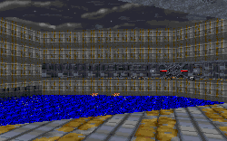

The story sounds great. It makes sense and is a good area for some new action to take place. All we ever get to hear is that Kyle delivered the plans. But why does it have to be so easy for him? I think that some kind of intervention there is a great idea. But unfortunately this level doesn't quite make good on the story.

Which isn't to say that it doesn't try. There are a lot of good ideas in here. In many places the architecture is very nice, and texturing overall matches like it should. What really hurts this mission is that ever present factor of monotony. The textures on the walls, however fitting, are almost always the same muted greys and blacks interspersed with little bits of color here and there. That gets real dull after a while, especially when most of the level is just running from corridor to corridor, trying to find your way around. It can be confusing and frustrating at times. Some other flaws are present in large open areas, where the same texture runs over and over again. Even large textures don't quite flesh this place out.

The puzzles aren't that challenging either. Once you find your way around the base it's just a matter of locating the keys and getting out. The opening sequence of your execution is really nice and tense with you needing to scramble for weapons and space to move with Kell Dragons on your tail and Imps up above. But after you actually get into the base the stimulation and challenge disappears.

There are several nice factors to this level though. I particularly enjoy the author's use of large areas. He's run a nice river through the base and it makes for some good scenery and variation as you move along. And after running through a base that's largely contained and cramped it's nice to find a bit of contrast. You won't find any HOMing in the large areas either, something that plagued most of these early levels.

Another nice bit is that the enemies aren't contained in rooms. The connected architecture of the level allows them to roam the halls so you're never sure what you'll run into. And you aren't given all the weapons to use either. For most of the level you'll have to content yourself with a rifle and some detonators. For the most part the troopers won't give you any trouble. But I wish that the Dark Troopers had been left out. This is before the Dark Trooper incident, so there shouldn't be any Phase II's running around, and possibly only one or two Phase I's. If the author had coordinated finding the plans with also running into some of the Rebellion's first evidence of the Dark Trooper project it would have made the level a lot more interesting.

## Overall

Back when it was made I'm pretty sure that this was one of the best levels to be found. A lot has passed since then and some might say that I should judge it taking into account the date it was released. But I like to keep everything on a standard level. So when you look at it that way Ravager Outpost comes out rather average. But still worth a run if you have some free time.
