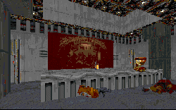

The first level to use Tatooine as a setting was original; it had lots of new things to keep you interested. This level has some new things too, but you can't seem to get past the feeling that it's just a rerun.

First off, the author recycles a lot of his previous level. While this is good, as it increases the believability that you're actually visiting the same place, and increases the continuity between levels, it also deadens the interest, especially if you just completed the previous mission. By having gone through it all before, you know your way around, know a lot of the puzzles, and even the new items don't seem quite as eye-catching. It's a lot like running through an adaption of the original Dark Forces levels. The second time is not nearly as fun.

Even the plot seems to have been done before. It really is just an adaption of all the rescue Madine levels, with Threepio in his place. While the author should be given a little credit for creativeness in the setting and the use of the droid in place of Madine, this plot is getting old real fast.

The author does throw in some new things to keep the level enjoyable. Boba Fett's base has been converted, and the area surrounding it has been expanded to include several new cliffs. But when you get right down to it, it's all pretty much the same.

## Overall

This level is best compared to a poor remake of a classic movie. The plot is twisted a little to provide some new entertainment, but when it's all over, you have an urge for the original version. If you're looking to play a Tatooine level, I'd pick one of the two the author has made. Doing both constitutes overkill.