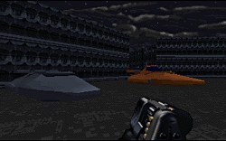

This was an excellent level. Right after I played this level, I was just so excited that I had to play it again and again. Not many people can successfully create an imperial city, but this author did a spectacular job of it in this level.

When I entered the city in this level, it felt different from other cities in other levels. It actually felt like I was in a city. This was by far the best city I've ever seen in a Dark Forces level. I really hate it when authors just give you all the weapons in the very beginning of a level, without any effort at all. In one part of the city you enter a local weapon shop where you can just steal all the guy's weapons. I think that this is an excellent way for the author to give you some weapons to live on, and have it still make sense. The owner of the store even gets mad when you take his guns.

Another highlight of the city is that you can actually enter people's homes, and there's even some landspeeders cruising through the streets. The texturing was good, and there's a good deal of enemies to keep you company. There weren't any new cutscenes, but the new briefing makes up for it. The level wasn't very difficult, although I wasn't able to play it on HARD because it crashed. Also, Windows users beware, you must run this under DOS, or there's a good chance it will crash on you in the middle of gameplay.

## Overall

Don't waste time deciding on whether or not to download this, and just click the download link. After playing this level you'll have a smile on your face for the rest of the day, so don't pass this one by.

