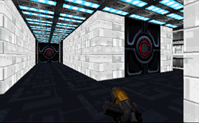

This is the second level from the author of "For Leia's Honor", a small level with the dubious premise that Kyle had to recover Han Solo's private snapshots of the Princess' drunken indiscretions. Since that first project, the author worked for more than a year to bring us "Return of the Jawa". I only wish the wait had been more worthwhile.

This is a large level that takes time to complete. In the most basic sense, it's a decent level design. Unfortunately, the author doesn't seem to feel that he has to provide more than the basics. The play experience is dull because the level suffers from artistic neglect. Familiar funk from the realm of schlock levels is here, such as a sky texture that doesn't fill the sky properly and Kell Dragons turned blue from being from being without their native color palette. Most of the base is on a single floor, and very little has been done to make this seem like more than a maze. Textures go together pretty well within each area but there is a wide variety of non-Imperial color schemes throughout the base. Some design work has gone into to the three objective areas (where you have to shut down a weapons array, a hangar bay, and a shield generator) but it's just adequate; generally I found too many switches attached to too little machinery. It's the areas in between the objectives that are truly lame: endless "ventilation" tunnels that don't add up to a "ventilation system", many doors indicated by nothing but texture, and rooms like boxfuls of enemies. It's hard to see a correlation between form and function because there is little of either. We don't even get to see the landing site of Kyle's ship, before or afterward.

There are many Imperial enemies, and of course the title characters, Jawas. The story explains why Jawas are here (assuming you buy the idea), but using nothing but regular stormtroopers would make more sense in an Imperial-base mission. It seems the author wanted to use the Jawa sprite and wrote his story accordingly, never mind that we're not on Tatooine. There are also numerous Gamorrean Guards and Grans lurking about, with no explanation why. To keep things "interesting" there are multiple-logic troopers, swarms of remotes, groupings of gun turrets, and Dark Troopers aplenty.

There are a couple areas where the author has designed the corridors to form words and shapes on the map. These don't contribute to the mission; they're just Easter eggs. I wish the time spent creating map doodles had gone into enriching the 3D environment.

Amid all this criticism, I must praise one truly excellent design feature that too few authors use: multiple routes of entry. The opening forces you to choose among one-way paths that lead into different parts of the base. This feature allows you to encounter elements in a different order when you play the mission again. Non-linear design is a hallmark of truly great levels. In this case, however, the lack of atmosphere leaves me with little desire to experience the alternate paths. This level will fill some playtime and give you plenty to shoot at, but it's not as satisfying as a level that delivers action and a rich exploration adventure.

## Overall

It doesn't suck. It's an adequate obstacle course and time killer, but there's not much more to it. The text file features some dialogue between Kyle and Jan that is amusing, though it establishes immediately that the author isn't going to give us a fully dressed *Star Wars* experience. I wish he hadn't mentioned that he spent over a year making this, because that knowledge only intensifies my disappointment over how two-dimensional the product is -- a point of wonder that is, tellingly, the most memorable thing about this mission.

