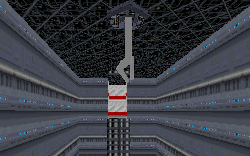

There seem to be more levels coming out that don't really have a plot but just like to showcase something that the author managed to figure out. Previously it was just some loopholes in the Dark Forces engine that were featured in the levels. This time the author shows you something that might be useful in future levels.

The idea is to hitch a ride on a crane hanging above a chasm. That's really all there is to it. It was a little difficult for me to figure out how to get on the crane at first, but practice makes perfect and soon it was pretty easy. There are a couple flaws with the current setup: you can't move or turn while on the crane, and if you try the movements are translated to you after you're dropped from the crane. But the idea is good and the execution is decent. You'd probably be a sitting duck for any Imperials around at the time, but I think it would be pretty cool to need to use the crane to get across some large hole at a factory or something. Maybe next time the crane could do more than just go back and forth.

Peter Klassen(the author) has told me that this GOB was an experiment in controlling the player object with a VUE. He explained to me some things about why it reacts the way it does:

1. If the player object is currently controlled by a VUE, he doesn't react on arrows or jumps. However he can sit down or look up/down. The rotations the player had during the VUE control get visible only after end of it.
2. The Yaw of the Player is always 0 when being translated by a VUE, i.e. I set up the level extra so that the player faces the far end. You can check it out if you turn back and hook on.
3. If the VUE'd player crosses a border between 2 sectors which would be deadly if the player jumped down, the player dies (you hear a cry, though there's no visible appearence of it)
4. There is also other thing. It seems that if a VUE'd object is shot at, the WAKEUP event is activated and therefore the player restarts the VUE trajectory. That makes it impossible to place enemies in these sectors.

So perhaps the idea could be used, but it would need to be used rather carefully. :-)

## Overall

I didn't find the level as interesting as some of the others like it that came before. It's a lot shorter for certain and there are no goals to accomplish. But hopefully somebody will pick up the idea and use it in a level at a future time. It shouldn't go to waste.