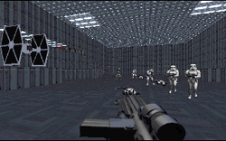

The plot to this one is a good start; sure it's not really new but at least an attempt has been made to put a slightly different spin on it. Unfortunately the author seems to have left the storyline behind in creating the level.
The author states this is his first level and it has deliberately been made simple (and even apologizes for how easy it is to play). If you're a seasoned DF player then this level is at best ten minutes target practice with most of that time spent waiting for it load.

That said, as a first-timer the designer has shown great restraint in not trying to fill this level with every enemy in the DF universe. The texturing too is very simple but well applied without over doing things. Sure most of the sectors use one texture over all of the walls but fortunately most sectors are quite small so you don't get the usual boredom of constantly looking at the same texture. There are a few questionable texture placements but these look to be more by design than accident; even so they don't really detract from the overall design.

What lets this level down (easiness aside) is that the author hasn't really matched the level to his plot. This is supposed to be a run down Imperial Prison in which Kyle is being held. Why then does Kyle start in a room in the middle of the facility that looks nothing like a prison cell? And why do only one or two sectors look run down? - DF has plenty of existing textures with the old, weathered look. In fact this level doesn't even have any prison cells in it. It is really just the barest of essentials in terms of sectors needed to make a level and a very loose attempt at combining it with the plot.

## Overall

This level shows that the author has (had? - this is a rather old level) the potential to design good levels. However the simpleness of this one makes it hardly worth the download.
