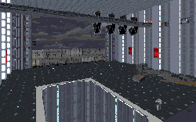

The story picks up right where Dark Forces left off, and the quality of the levels does a pretty good job of picking up there too. The three levels in this set tell the story of Kyle's escape from prison, the destruction of the base and the recovery of his ship.

The author has spread out the different story points in a logical fashion, so the whole experience doesn't come to a halt when one level gets over. Another he's done to keep the levels flowing is to use certain familiarities between levels to increase continuity. He uses the same style of architecture in the buildings to make it seem as if the whole area was built at the same time, and he is also sure that two things look the same from one level to the next. If you stop in front of one entrance, the entrance at the beginning of the next level is the same.

His attention to details seems to vary from place to place however. There are lots of spaces where I thought a sound was missing, mostly occuring in elevators. For instance, I would expect that when a large freight elevator is moving in front of me that it would make a sound like and elevator. In here it was noticeably silent. I also thought that some new sounds could have used some work; while interesting efforts, they lacked somewhat in quality. It was very obvious that they were new, and it jolted the game off it's tracks for a while, rather than add to the experience.

In other places the author has done a great job. I noticed that I couldn't walk right through the speederbikes as you can walk through other things in some levels. The hangars have several nice touches added to them, that even though they haven't been seen before, feel natural in such a setting. The forcefields also had a nice bit that occurs logically, but is noticeably lacking in other levels.

The real problem that keeps these levels from suceeding is the architecture. The first level is not much more than the same design repeated over and over with slight variations. The second level was better, but even then I felt like I'd been through places before. I can understand that the author might have wanted to make sure that a certain style of area got associated with a certain action, like shutting off a force field, but after a while it gets a bit repetitive and I start to pay less attention to what's going on. In order ensure the player is always entranced in a level, authors should try to always keep something new happening.

## Overall

Not the best, not the worst. Some things could certainly be better, but that can be said for everything. I think you'll enjoy this three level set.