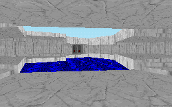

Save me from an endless supply of Death Star plans levels! PLEASE!

Well, I really can't gripe. It's been a long time since I've even run through SECBASE, so the Death Star plan idea while still stale and unimaginative is not quite as loathed as it might otherwise be. Especially considering that the level is really well constructed.

Quite easily the best thing about the mission is the mountain range itself. The author has created a very impressive setting for you to work in and splendidly depicts the massive surroundings complete with waterfalls, lakes, rivers, caverns and lots of other things to see. I think that this is the first time I've fallen out a window looking at the scenery. Which brings me to another point: the architecture is also very nice with lots of open windows to view the mountain range, although not quite as widespaced as I might like. You can't look out over the horizon which would have been nice, but the closed in feeling doesn't detract at all from the level.

A nice idea that keeps this level away from monotony is that there is more than one way into the Imperial center. Numerous caverns wind their way through the mountains so while the overall feeling might be one of enclosure, you also can tell that there's a lot more to the place than you might have the chance to explore.

The author has done a good job in the usual category of texture placement and has included enough enemies and weapons to keep you shooting throughout the mission. There are a few shortcomings involving these scattered across the facility, but it isn't a major problem.

What is a problem is the lack of direction for this level. With a pretty dry plot to start with, the level also fails to really go anywhere. There are lots of nice places to look at and the gameplay is pretty good, but several areas feel more like a place to demonstrate the author's abilities rather than to serve a purpose. Granted, they're cool, but what's the point? Having a better objective in mind and perhaps unveiling some hidden agendas or twists to a plot would have helped give the level a little more direction.

## Overall

It's a very technically impressive level, and it's also lots of fun. It certainly has room for improvement, and to see something new added would definitely have been nice, but I think you'll want to try it out and I think you'll enjoy it too.
