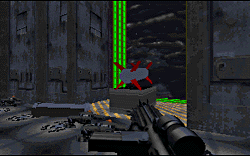

My initial reaction to the title of the level was that the authors had enjoyed last summer's "The Rock" movie so much that they wanted to name their mission after it. Unfotunately it appears that the authors have gone far beyond just using the name: they've appropriated the entire plot.

To be fair, the story is modified for Star Wars use, pulling in elements from Timothy Zahn's novels(however much destroyed and rewritten; a major discretion in my opinion) and it's not a complete ripoff. But there are so many elements in here that are derived directly from the movie that it borders on disgusting: the way you enter the base, the missile system C'Baoth has, and several other happenings in there level are pulled from "The Rock and dropped in here.

There are times in this mission when your heart begins to race and you wonder if you'll ever manage to make your way out again. But that's mostly due to the authors' use of the story, rather than their own work. The texturing is borderline, in places looking very nice and in others rather slipshop; to the level's detriment the entire area is made up of boring gray with low lighting, nothing that particularly excites you. The architecture isn't completely made up of 90 degree angles but it still fails to provoke any real interest. The city that surrounds the Imperial installation is bustling, with civilians, beggars, landspeeders crowding the streets, but I gathered the feeling that it was all for show, inserted to add something that people could talk about after the level was finished. It played no pivotal role in the mission and I quickly found myself tiring of it.

The water sequence at the beginning seems to have been built off the similar area in Archangel II, but here it isn't nearly as interesting. The lighting is all the same and you merely run through straight corridors where it's obvious what's been done. There's nothing to catch your attention!

## Overall

This certainly isn't a poor level. Despite the author's misguided decision to pattern the level after existing material, it supplies you with a fairly satisfying experience. But lacking the creativity we've seen put into other missions this one tastes flat.
