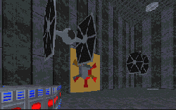

The story has some large conflicts, not only with the Dark Forces plot laid out by LucasArts, but also with the established sequence of events in Star Wars. For the most part, the problems with this level end there. The rest is a nice blend of tried and true design with new ideas.

The level isn't big, but there is plenty of extra space to explore, and the design is interesting, with textures placed in areas where they fit and make sense. It's apparent that the author spent the time to go through and scrutinize all the aspects of this level before release, and didn't put something in just for the sake of having it there. The different areas in the level all have a distinct feel to them, from open expanses by the river and dam, to the functionality of the mining facility, to the ominous hangar where you find the TIE Fighter prototypes and make your escape. You can't help but feel a sense of foreboding as the elevator brings you down into the dark room where the TIEs are kept, knowing the havoc the fighters will wreak in the years to come.

There are a few flaws; some of the overhangs by stairways require you to duck, and there's a portion of the river that doesn't move due to a suspended bridge above it. However, there are nice points as well. The dam was a nice touch, the officer's lounge overlooking the canyon was cool too. My biggest gripe was that the level was just too easy. Aside from a massing of stormtroopers and commandos in the shuttle bay, there was nothing to really jeopardize your progress, even if you skipped the revives. There were no difficulty levels to customize gameplay, so I couldn't make it tougher, and the puzzles in the level weren't all that challenging. But then, if making the level tougher would have meant adding a few Dark Troopers, I'd choose to leave it the way it is.

## Overall

When it comes right down to it, the thought put into the design and story for this level are what set it apart from other levels. It's not great, but the flaws are minor, so if you're looking for a quick level to run through, give this one a chance.