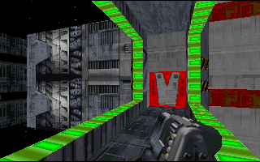

Sound interesting?......well, the level for the most part is very interesting.

This level is pretty well made, with the author showing a good knack for design and texturing, even if it is some what inconsistently shown. Some rooms look boring because of repeated use of the same texture, while other rooms use textures beautifully to enhance the design. The bar/disco room looks very good, with perfectly timed lighting effects used to simulate a disco beat. The rest of the level is also lighted well which adds to the atmosphere. There is not much repetition of room design which is good; every location has it's own feel and design features.

The level appears not to have been edited too well as it suffers from some errors that could be easily fixed. Firstly there is one area looking out into space where the sky textures aren't the space texture, but normal floor and ceilings texture......well, you'll know it when you see it. A lot of textures, particularly above doors, are not stitched properly, but this is not a big problem. One thing that you'll notice right from the start, due to the start location, is that the author does not how to make walls become horizons, meaning that if you look out into space the stars look like solid walls. Certain elevators also have errors that have the wall textures scroll when they should remain stationary. Also, like a lot of levels the author didn't make 3D objects solid.....In this case it was the Crow and being able to walk straight through it is not overly realistic. This, like the 'solid star walls' problem, could easily be fixed.

The freighter bit is very well done and really looks like a ship in a docking bay. The area leading up to the showdown with Boba Fett is very well done involving some very nice architecture and some fairly simple 'find the switch' problems. The problem here is that the Boba Fett showdown is completely unrelated to the plot and out of place.

Triton Spaceport is not an overly hard level.....until Boba Fett shows his ugly mug at least. Enemies, ammo, and power-ups are well placed with a few new enemies thrown in to spice things up.

## Overall

A pretty good level that could have looked a lot better with just some minor work..... By the story, it looked like a sequel could have been a possibility, but no.....anyway it's definitely worth a look.
